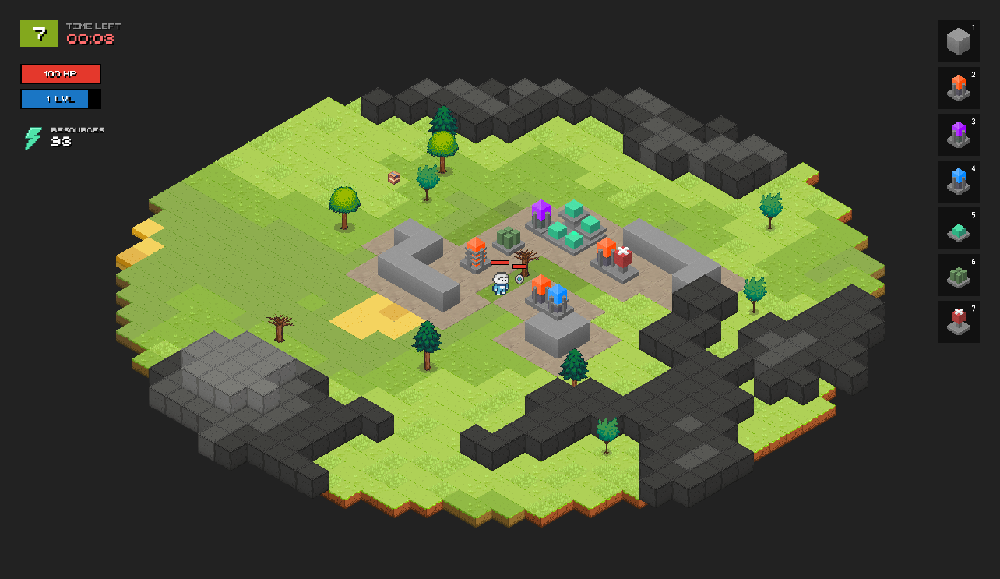

## 

Your task is to survive as many waves as possible. With each wave, the number of enemies and their characteristics will grow.

Between waves there are built walls to defend, towers to attack, mines to generate resources, and medics to replenish health. Also, do not forget to upgrade your buildings so as not to yield to enemies.

You will spawn in a random place. Can start to build here, or can look for a place for better defense. But you don't so much time!

* ### __[Play now](https://izowave.neki.guru)__
* ### __Screenshots__

