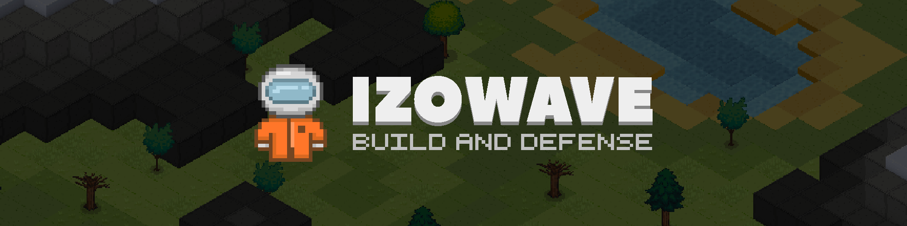

## 

Your task is to survive on chosen planet as many waves as possible. 
With each wave count of enemies and their characteristics will grow.

Build walls to defend, towers to attack, ammunitions to reload towers and generators to get more resources.

And also upgrade skills of your character and his assistant.

**Join Discord - https://discord.gg/cnFAdMsRxn**

## 🎮 [PLAY NOW](https://izowave.neki.guru/)
  * *Itch.io* / https://neki-dev.itch.io/izowave
  * *CrazyGames* / https://www.crazygames.com/game/izowave---build-and-defence
  * *GameJolt* / https://gamejolt.com/games/izowave/822933

.

|  |  |  |
|---|---|---|
